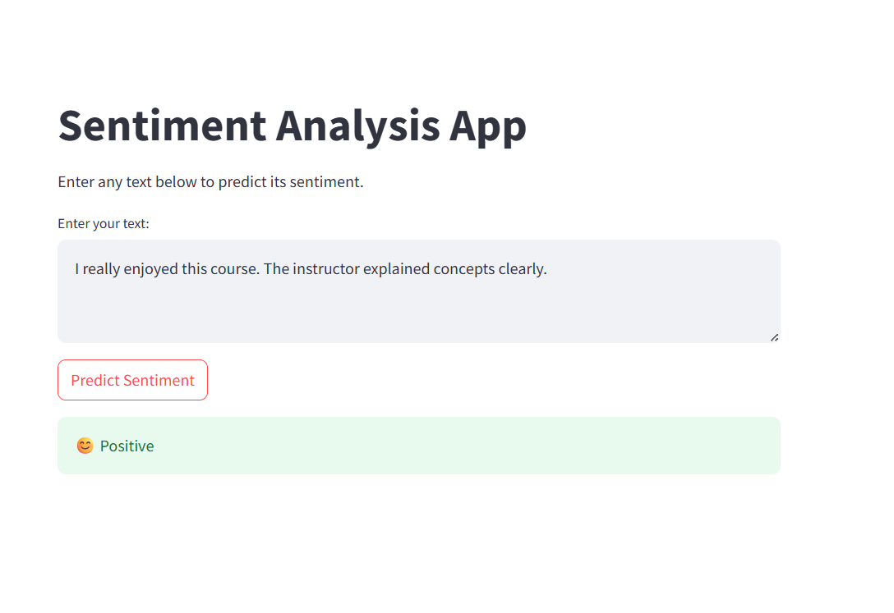
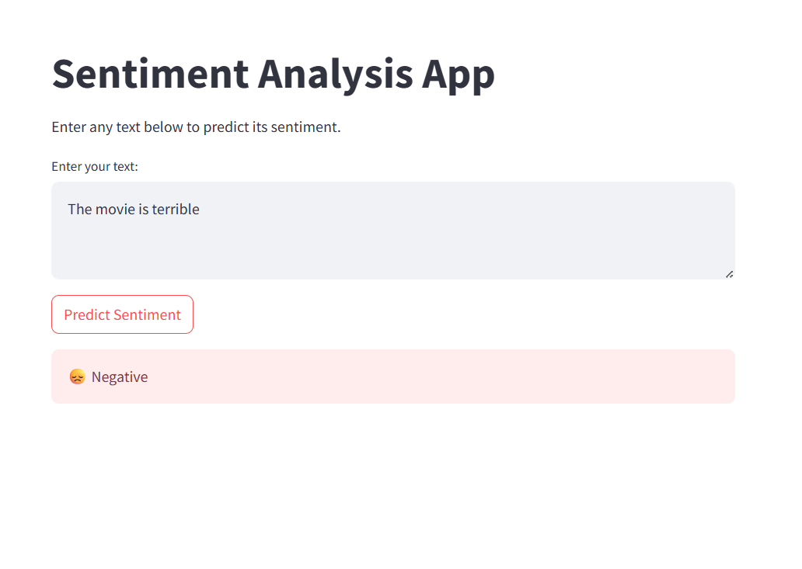
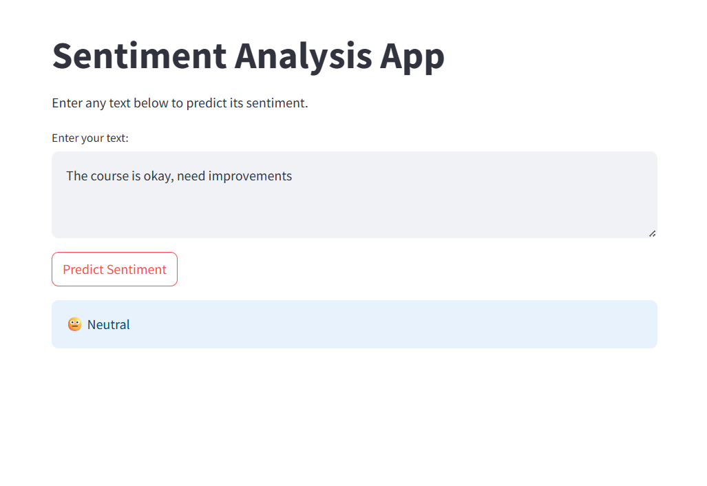

# Sentiment Analysis using Machine Learning

## Project Description

This project is a Sentiment Analysis application that classifies text into Positive, Neutral, or Negative sentiments using Machine Learning. The model is trained on a Twitter dataset and deployed using Streamlit.

## Dataset

- Dataset: Tweets.csv
- Source: Twitter sentiment dataset
- The dataset contains tweets labeled as Positive, Neutral, or Negative.

## Libraries Used

- Python
- Pandas
- NumPy
- NLTK
- Scikit-learn
- Matplotlib
- Streamlit
- Joblib

## Text Preprocessing

The following preprocessing steps were applied:

- Converted text to lowercase
- Removed URLs and special characters
- Tokenized the text
- Removed stopwords
- Applied lemmatization
- Converted text into TF-IDF vectors

## Machine Learning Models

The following machine learning models were implemented and compared:

- Logistic Regression
- Naive Bayes
- Support Vector Machine (SVM)

The best-performing model was saved using Joblib for deployment in the Streamlit application.

## Evaluation Metrics

The models were evaluated using:

- Accuracy
- Precision
- Recall
- F1-Score
- Confusion Matrix

## Streamlit Application

A Streamlit web application was developed to allow users to:

- Enter text
- Predict the sentiment
- Display the sentiment as Positive, Neutral, or Negative

## Streamlit Application Screenshots

### Positive Sentiment Prediction

### Negative Sentiment Prediction

### Neutral Sentiment Prediction

## How to Run

1. Install the required libraries.
2. Open the project folder.
3. Run the following command:

streamlit run sentiment_app.py

4. Open the local URL displayed in the browser.
5. Enter any text and click **Predict Sentiment**.

